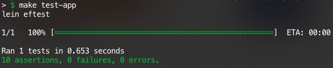

# Availability Calculator

An open source service to calculate the daily availability based on an agenda.

## Table of Contents

1. [Availability Calculator](#availability-calculator)
2. [Table of Contents](#table-of-contents)
3. [Context of the problem](#context-of-the-problem)
    1. [Existing tools](#existing-tools)
4. [Solution](#solution)
    1. [How it works](#how-it-works)
    2. [Structure of the code](#structure-of-the-code)
5. [Prerequisites](#prerequisites)
6. [Development workflow](#development-workflow)
    1. [Installing dependencies](#install-dependencies)
    2. [Running](#running)
    3. [Testing](#testing)
7. [License](#license)

## Context of the problem

Due to the new normality caused by the COVID-19 pandemic, most of students and employees were forced to work at home, which caused many new problems that had to be solved. One of those problems is the one related to time management.

As a student that also has a part time job, differentiating between school/job and time to rest is a very difficult task. Since you spend virtually all day in front of a computer screen (two in my case), you could end up with vision issues, chronic neck and back pain, among others [\[1\]][8].

Having a tool that helps you to manage your time and the amount of work you do in your daily life must be something to have in consideration. 

### Existing tools

Even though there are many other tools to be ready for use in a public web site and help you to manage your time, many of those are an overkill for certain tasks, like knowing my percentage of daily availability based on my events in a particular day. Many examples are [Google Calendar][4], [Apple Calendar][5], [Microsoft Outlook Calendar][6], and many others (as listed in [this][7] Zapier blog post).

[return to the top.](#table-of-contents)

## Solution

As seen above in [Context of the problem](#context-of-the-problem), staring at a computer screen may cause many chronic issues in the human health. This is why I came up with this little acupuncture (idea or prototipe to make a small change), to help others with the same problem of time management. In this project, I developed a simple availaiblity calculator in Clojure, using functional programming, and a visual web application in ReactJS, also using functional programming in the great majority of the code base. 

### How it works

If you take a look at the source code, you will notice (among other things) that the first class citizens of the codebase are the lists and functions (given I used functional programming, that was something to wait for). The main collection of data is the `calendar` or `list` of `busy times`. That list of `busy times` is what the program takes into count for calculating the result, getting the complement for th `busy times`, getting `available times`.

### Structure of the code

The following directories and files are the most important in the project.

* `src/clj/availability/`
    * `controllers/availability.clj` - Is the main file for the backend, where all the *magic* happens.
    * `middleware.clj` - Other important file, mainly for handling errors.
* `test/clj/availability/`
    * `handler_test.clj` - All the unit tests for the backend are placed in there.
* `webapp/src/`
    * `index.js` - Main entry point for the application.
    * `components/App` - App component, where API calls are made.
    * `components/Calendar` - Main component, all the styling, filtering and validations are made in here.

[return to the top.](#table-of-contents)

## Prerequisites

You will need [Leiningen][1] 2.0 or above installed.
Optionally, you will need [NodeJS][2] 8.10 or above and [Yarn][3] 1.0 or above installed to be able to run the web application.

[return to the top.](#table-of-contents)

## Development workflow

To help (and give hints to future contributers for) the coding workflow, I included a super simple [makefile][9] with common tasks in the development of the project.

### Install dependencies

To install the dependencies, run:

    make install

This will install frontend dependencies. There is no need to install backend dependencies manually, since those are installed via `lein`, go to the next section.

### Running

First, start the web server for the application:

    make start-server 

Then, start the web application:

    make start-web

[return to the top.](#table-of-contents)

## Testing

To test the web server, run:

    make test-app

I'll describe the testing, since sometimes the process is tricky.

When run the command above, you'll get something like this:



As you can see in the image, 10 assertions where made. Feel free to add more tests if you find a missing escenario. The list of cases:

* `success availability` - When all the inputs are filled and valid, the result should be succesful.
* `only two available slots when two events overlap` - When in the input are only two events, that overlap to each other, the result should be a list of two elements. For example: when the input is:

```clojure
{
    :day-starts "08:00",
    :calendar [["10:30", "11:25"], ["11:10", "12:30"]],
    :day-ends "18:00"
}
```

The result should be:

```clojure
{
    :available [["08:00", "10:30"], ["12:30", "18:00"]]
}
```
* `last event finishes later than day-ends hour` - Take the following input for example:

```clojure
{
    :day-starts "08:00",
    :calendar [["10:30", "11:25"], ["17:30", "19:25"]],
    :day-ends "18:00"
}
```

As you can see, the last event finished later than the end of day hour, then the result should be:

```clojure
{
    :available [["08:00", "10:30"], ["11:25", "17:30"]]
}
```

* `last event finishes later than initial day-ends and overlaps` - Both overlaping and events after the day ends.

```clojure
{
    :day-starts "08:00",
    :calendar [["10:30", "18:25"], ["17:30", "19:25"]],
    :day-ends "18:00"
}
```

Should give:

```clojure
{
    :available [["08:00", "10:30"]]
}
```

[return to the top.](#table-of-contents)

## License

Copyright © 2020 Topiltzin Hernández Mares

Distributed under the GNU General Public License version 3.0.

[return to the top.](#table-of-contents)

[1]: https://github.com/technomancy/leiningen
[2]: https://github.com/nodejs/node
[3]: https://github.com/yarnpkg/yarn
[4]: https://calendar.google.com
[5]: https://support.apple.com/guide/icloud/what-is-icloud-calendar-mmd67283e4/icloud
[6]: https://support.office.com/en-us/article/welcome-to-your-calendar-6fb9225d-9f9d-456d-8c81-8437bfcd3ebf
[7]: https://zapier.com/blog/best-calendar-apps/
[8]: https://www.carewellurgentcare.com/2018/07/19/the-effects-too-much-screen-time-has-on-your-health/
[9]: https://www.gnu.org/software/make/manual/make.html#Introduction
